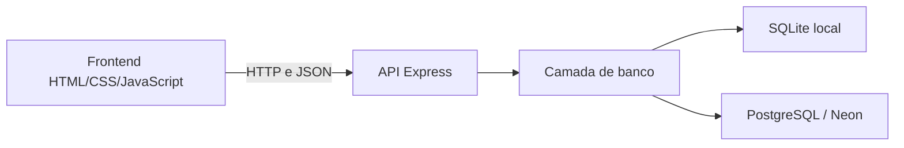

# Helmet Store

Projeto individual de **João Victor**, desenvolvido para fins acadêmicos. A Helmet Store é uma loja fictícia de capacetes com catálogo público, autenticação de usuários e administração de produtos. A interface é responsiva e se comunica com uma API própria, com dados persistidos em banco.

## Objetivo acadêmico

Aplicar os fundamentos de desenvolvimento web em uma aplicação completa: organização de frontend e backend, comunicação HTTP, operações CRUD, bancos relacionais, autenticação, autorização, testes, versionamento e publicação na web.

Os produtos, preços, estoques e ilustrações são demonstrativos. Não representam um catálogo comercial ou certificações técnicas reais.

## Funcionalidades

- Catálogo carregado pela API, com nome, descrição, categoria, preço em reais e estoque.
- Modal de detalhes com consulta individual do produto.
- Cadastro de usuários e login/logout.
- Sessões persistidas no banco, restauradas visualmente ao recarregar a página.
- Perfis `customer` e `admin`, com permissões verificadas no backend.
- Área administrativa para cadastrar, listar, editar e excluir produtos, com confirmação de exclusão.
- Atualização do catálogo após alterações administrativas, sem recarregamento manual.
- Mensagens de carregamento, sucesso, validação e falha de conexão.
- Layout adaptável a telas menores, formulários com rótulos e estados de foco visíveis.

O carrinho é apenas visual. Compras, pedidos, pagamentos, recuperação de senha e confirmação de e-mail não fazem parte desta versão.

## Tecnologias

| Camada | Tecnologias |
| --- | --- |
| Frontend | HTML5, CSS3 e JavaScript puro; Fetch API e manipulação do DOM |
| Backend | Node.js 22 e Express 5 |
| Desenvolvimento local | SQLite com `better-sqlite3` |
| Produção | PostgreSQL hospedado no Neon, com `@neondatabase/serverless` por HTTP |
| Autenticação | `node:crypto`, scrypt e sessões persistidas no banco |
| Testes | `node:test` e `node:assert/strict` |
| Hospedagem | Vercel |
| Versionamento | Git e GitHub |

Não são utilizados frameworks de interface como React, Vue ou Bootstrap.

## Arquitetura



A camada de conexão seleciona um banco por ambiente, sem gravar simultaneamente nos dois. Rotas tratam as requisições, validam entradas e usam consultas parametrizadas. Middlewares verificam sessão e permissões nas operações administrativas.

Localmente, `backend/src/server.js` inicia o Express e serve o frontend. Na Vercel, `api/index.js` exporta o mesmo app; os arquivos estáticos são publicados de `public/` e as chamadas `/api/*` são encaminhadas à função Node pelo `vercel.json`.

## Estrutura principal

```text
helmet-store/
├── api/index.js                 # Entrada da função na Vercel
├── backend/src/
│   ├── server.js                # Configuração do Express e execução local
│   ├── auth/                    # Hash, sessão e autorização
│   ├── database/                # Adaptadores, esquema, seed e consultas
│   └── routes/                  # Rotas de produtos e autenticação
├── frontend/src/
│   ├── index.html
│   ├── css/styles.css
│   └── js/                      # Catálogo, autenticação e administração
├── database/                   # Banco SQLite local, não versionado
├── scripts/                    # Build e promoção de usuário para admin
├── tests/                      # Testes automatizados e auxiliares
├── docs/                       # Documentação técnica e apresentação
├── public/                     # Saída gerada pelo build, não versionada
├── .env.example                # Referência de configuração sem segredos
├── .gitignore
├── package.json
├── package-lock.json
└── vercel.json
```

## Instalação e execução local

Pré-requisitos: Node.js **22.x**, npm e uma cópia do repositório.

Na raiz do projeto:

```sh
npm install
npm start
```

Acesse **http://localhost:3000**. A porta pode ser alterada pela variável de ambiente `PORT`.

Sem conexão PostgreSQL configurada no ambiente, a aplicação usa `database/helmet-store.db`. Na primeira operação que acessa o banco, as tabelas são criadas se necessário. Uma tabela de produtos vazia recebe os quatro capacetes fictícios do seed.

Para desenvolvimento local com SQLite, não é necessário configurar credenciais. O arquivo `.env.example` é uma referência, não um segredo: `npm start` não carrega arquivos `.env` automaticamente. Configurações devem ser disponibilizadas no ambiente do processo. Não use a conexão de produção para testes locais comuns.

## Testes e build

```sh
npm test
npm run vercel-build
git diff --check
```

A suíte utiliza bancos SQLite temporários e verifica CRUD, validações, cadastro, login, sessão, logout, autorização administrativa, promoção de usuário e respostas sem informações internas. O driver Neon é exercitado com transporte HTTP simulado, sem acesso a credenciais ou ao banco de produção.

No fechamento documental, o executor registrou **29 testes aprovados**, contando os subtestes. Isso não representa cobertura total do código nem substitui testes de integração com um PostgreSQL real. A responsividade e a interação visual são verificadas separadamente no navegador, não por `npm test`.

O build copia `frontend/src/` para `public/` e verifica a presença dos arquivos essenciais. Ele não publica a aplicação e não executa os testes automaticamente. A saída gerada não deve ser editada manualmente.

## Principais endpoints

| Método | Endpoint | Finalidade | Acesso |
| --- | --- | --- | --- |
| GET | `/api/health` | Verificação simples da API | Público |
| GET | `/api/products` | Listar produtos | Público |
| GET | `/api/products/:id` | Consultar um produto | Público |
| POST | `/api/products` | Cadastrar produto | Admin autenticado |
| PUT | `/api/products/:id` | Atualizar produto completo | Admin autenticado |
| DELETE | `/api/products/:id` | Excluir produto | Admin autenticado |
| POST | `/api/auth/register` | Cadastrar usuário customer | Público, com validação |
| POST | `/api/auth/login` | Autenticar e criar sessão | Público, com validação |
| GET | `/api/auth/me` | Consultar dados públicos da conta | Sessão válida |
| POST | `/api/auth/logout` | Revogar sessão e expirar cookie | Sessão atual; também aceita ausência de sessão |

A página visual é entregue em `/`. O endpoint de health confirma a resposta da API, mas não testa a disponibilidade do banco.

Escritas autenticadas usam o cabeçalho `X-Helmet-Request: 1`. POST e PUT recebem JSON. O frontend já envia os cabeçalhos necessários. Respostas principais: `201` para cadastro, `400` para entrada inválida, `401` sem autenticação válida, `403` sem permissão ou por proteção de requisição, `404` para produto inexistente, `409` para e-mail duplicado e `429` para excesso de tentativas de autenticação.

## Perfis de acesso

| Perfil | Permissões |
| --- | --- |
| Visitante | Consultar catálogo e detalhes; cadastrar-se e fazer login |
| Customer | Consultar catálogo e acessar sua sessão; sem gerenciamento de produtos |
| Admin | Permissões da conta e CRUD visual de produtos |

O cadastro cria somente `customer`. O cliente não escolhe a role. Uma conta existente é promovida pelo script local `scripts/promote-admin.js`, conforme o [procedimento administrativo](docs/admin.md). Não existe administrador predefinido. Ocultar botões é uma medida de interface; a autorização efetiva é aplicada no servidor a cada escrita.

## Segurança e validação

- **Senhas:** hash com scrypt assíncrono, salt aleatório por senha e comparação com `timingSafeEqual`. Não são armazenadas em texto puro nem retornadas pela API.
- **Sessões:** identificadores aleatórios, apenas seus hashes no banco, validade de sete dias e revogação no logout. A sessão apresentada é rotacionada no login.
- **Cookies:** HttpOnly e SameSite=Lax; Secure e prefixo `__Host-` em produção. HttpOnly impede leitura pelo JavaScript da página, mas não substitui outras proteções.
- **Validação dupla:** HTML/JavaScript orientam o usuário; o backend valida novamente, independentemente da interface.
- **Cadastro:** nome de 2–60 caracteres após trim, e-mail válido e normalizado até 120, senha de 8–72 caracteres e e-mail único.
- **Produtos:** textos não vazios, preço finito positivo, estoque inteiro seguro não negativo e ID inteiro positivo. Os limites adicionais de tamanho de texto do formulário estão em [Administração](docs/admin.md).
- **SQL:** dados recebidos são passados como parâmetros, separados dos comandos.
- **Autorização:** operações administrativas exigem sessão válida e role consultada no banco.
- **Requisições:** proteção CSRF com cabeçalho específico e verificação de origem indicada pelo navegador; limite persistido de tentativas por ação/e-mail.
- **Interface:** dados dinâmicos são inseridos com `textContent`, evitando sua interpretação como HTML.
- **Segredos:** configuração privada por variáveis de ambiente; respostas genéricas em erros internos. Credenciais, informações de conexão e dados privados de sessão não devem ser publicados ou versionados.

## Banco de dados

O desenvolvimento usa **SQLite**, armazenado em arquivo local. Em produção, a conexão configurada no servidor seleciona **PostgreSQL/Neon**. Se PostgreSQL estiver selecionado e falhar, não há troca silenciosa para SQLite.

As tabelas principais são `products`, `users`, `sessions` e `auth_limits`. A inicialização é idempotente. O seed só insere os quatro produtos se a tabela estiver vazia; no PostgreSQL, uma transação com bloqueio coordena inicializações concorrentes.

Os dados locais não são sincronizados ou migrados automaticamente para o Neon. O fallback SQLite temporário disponível na Vercel, quando falta a configuração PostgreSQL, não oferece persistência de produção; o ambiente publicado deve usar Neon.

## Deploy na Vercel

A aplicação é hospedada na Vercel, com o repositório conectado ao GitHub. No fluxo do projeto, com `main` configurada como branch de produção e a integração ativa, **novos pushes na `main` geram deployments**. A publicação depende do sucesso do build e das configurações da plataforma. [Referência da integração GitHub/Vercel](https://vercel.com/docs/git/vercel-for-github).

O projeto utiliza a raiz do repositório, build `npm run vercel-build`, saída estática `public/` e uma função Node para a API. Os detalhes estão em [Deploy e ambiente](docs/vercel.md). Alterações apenas locais não atualizam a aplicação publicada.

## Versionamento com Git

Git registra o histórico de alterações em commits; GitHub hospeda o repositório remoto. Um commit registra uma versão local e um push envia commits ao remoto. Como o push na branch de produção pode iniciar um deploy, deve ser feito conscientemente após revisão e testes.

O `.gitignore` exclui dependências instaladas, arquivos privados de ambiente, banco SQLite local e `public/` gerado. O exemplo de ambiente e o lockfile são versionados. Antes de preparar uma entrega, confira `git status`, `git diff`, `npm test` e `git diff --check`.

## Documentação complementar

- [Roteiro de apresentação e conceitos](docs/apresentacao.md)
- [Autenticação e sessões](docs/auth.md)
- [Administração e promoção de conta](docs/admin.md)
- [Deploy e ambiente](docs/vercel.md)

## Autor

**João Victor** — desenvolvimento individual para fins acadêmicos.
